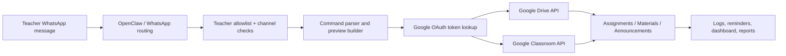

# AI Google Classroom Assistant using OpenClaw

An OpenClaw-powered WhatsApp classroom assistant for teachers.

Teachers can message the bot in simple language to:

- list and select Google Classroom courses
- create assignments with deadlines and marks
- upload study material from local files or Google Drive
- post announcements to one or many classes
- preview actions before publishing
- track reminders, submissions, and activity logs
- use a local RAG assistant for document Q&A and MCQ generation

This repository is the classroom-only workflow. The bot is configured to focus on Google Classroom automation, not general-purpose assistant skills.

## How It Works



## Current Features

- teacher allowlist with WhatsApp phone normalization
- private teacher DM guard
- Google OAuth login and token storage
- Classroom course sync and course selection
- assignment, material, and announcement creation
- local file staging and Google Drive upload support
- preview and approval flow before publish
- multi-class posting
- deadline reminders and submission reports
- local dashboard for activity, files, errors, and outbox
- RAG document assistant with PDF/DOCX/TXT support
- optional token encryption for production-style use

## Repository Layout

```text
assistant_cli.py                # main CLI entry point
classroom_assistant/            # application modules
docs/                           # milestone and deployment docs
data/                           # SQLite DB, uploads, and sample files
scripts/                        # scheduled reminder helper
tests/                          # unit tests
```

## Quick Start

From the project root:

```powershell
python -m venv .venv
.\.venv\Scripts\python.exe -m pip install -r requirements.txt
python assistant_cli.py init-db
python assistant_cli.py add-teacher --name "Your Teacher Name" --phone "+92XXXXXXXXXX" --google-email "teacher@example.com"
python assistant_cli.py message --phone "+92XXXXXXXXXX" --text "Hi"
```

If you want to run the full test suite:

```powershell
python -m unittest discover -s tests
```

## Google Setup

Enable these APIs in your Google Cloud project:

- Google Classroom API
- Google Drive API

Then connect the teacher account:

```powershell
python assistant_cli.py google-check
python assistant_cli.py google-login --phone "+92XXXXXXXXXX"
python assistant_cli.py google-status --phone "+92XXXXXXXXXX"
```

## Common Commands

List and select classes:

```powershell
python assistant_cli.py courses --phone "+92XXXXXXXXXX"
python assistant_cli.py select-course --phone "+92XXXXXXXXXX" 2
python assistant_cli.py selected-course --phone "+92XXXXXXXXXX"
```

Preview and publish classroom actions:

```powershell
python assistant_cli.py parse "Class 10 Computer mein Python Loops assignment banao. Deadline 15 July 2026 6 PM. Marks 25."
python assistant_cli.py message --phone "+92XXXXXXXXXX" --text "Class 10 Computer mein Python Loops assignment banao. Deadline 15 July 2026 6 PM. Marks 25."
python assistant_cli.py message --phone "+92XXXXXXXXXX" --text "2"
python assistant_cli.py message --phone "+92XXXXXXXXXX" --text "Class 9 Physics mein announcement post karo: Tomorrow class cancelled."
```

File handling:

```powershell
python assistant_cli.py receive-file --phone "+92XXXXXXXXXX" --path "C:\path\to\worksheet.pdf"
python assistant_cli.py find-file "Task Req def and specification"
python assistant_cli.py upload-latest-file --phone "+92XXXXXXXXXX"
```

Operational helpers:

```powershell
python assistant_cli.py history --phone "+92XXXXXXXXXX"
python assistant_cli.py submission-report --phone "+92XXXXXXXXXX"
python assistant_cli.py deadline-reminders --phone "+92XXXXXXXXXX"
python assistant_cli.py due-today --phone "+92XXXXXXXXXX"
python assistant_cli.py reminder-job --send
python assistant_cli.py whatsapp-outbox
python assistant_cli.py dashboard
python assistant_cli.py debug-logs
python assistant_cli.py security-key
```

## RAG Assistant

The repo also includes a local document assistant for teaching material and question answering.

```powershell
python assistant_cli.py rag-init
python assistant_cli.py rag-upload --phone "+92XXXXXXXXXX" --path "C:\path\to\chapter.txt" --category "Class 9 Biology"
python assistant_cli.py rag-documents --phone "+92XXXXXXXXXX"
python assistant_cli.py rag-process --phone "+92XXXXXXXXXX" --document-id 1
python assistant_cli.py rag-ask --phone "+92XXXXXXXXXX" "What is this chapter about?"
```

## WhatsApp Flow

Typical teacher flow:

1. Send `Hi` or `Show classes`.
2. Bot checks the allowlist and loads the teacher profile.
3. Bot lists Google Classroom courses.
4. Teacher sends a natural-language task.
5. Bot shows a preview.
6. Teacher replies with `1`, `2`, or `3` to publish, save draft, or cancel.

Example:

```text
Teacher: Class 10 Computer mein Python Loops assignment banao. Deadline 15 July 2026 6 PM. Marks 25.
Bot: Please confirm...
Teacher: 1
Bot: Done. Assignment posted...
```

## Milestones

The implementation is documented in milestone notes under `docs/`:

- `docs/MILESTONE_1.md` - WhatsApp bot setup and teacher access control
- `docs/MILESTONE_2.md` - Google OAuth login
- `docs/MILESTONE_3.md` - course sync and selection
- `docs/MILESTONE_4.md` - command parsing and previews
- `docs/MILESTONE_5.md` - assignment creation
- `docs/MILESTONE_6.md` - file upload and attachment flow
- `docs/MILESTONE_6_5.md` - follow-up classroom automation work
- `docs/MILESTONE_7.md` - RAG expansion and document workflows
- `docs/RAG_MILESTONES.md` - document assistant roadmap

## Security Notes

- keep OAuth credentials private
- use the teacher allowlist only for trusted numbers
- never auto-publish without preview approval
- encrypt tokens before production use
- keep activity and error logs
- restart OpenClaw after config or skill changes

## License

No license has been added yet. Add one before public distribution if needed.
